### This page is a work in progress, I wanted it published while I write it though. Think of it as a livestreamed publication. (it is currently unedited and may contain grammatical and spelling errors)

Over the past month the Zoom video conferencing application has [piqued](https://www.fbi.gov/contact-us/field-offices/boston/news/press-releases/fbi-warns-of-teleconferencing-and-online-classroom-hijacking-during-covid-19-pandemic) the [interest](https://www.bleepingcomputer.com/news/security/zoom-lets-attackers-steal-windows-credentials-run-programs-via-unc-links/) of the [security](https://www.theregister.co.uk/2020/03/27/doc_searls_zoom_privacy/) [community](https://krebsonsecurity.com/tag/zwardial/) due to its global adoption during the NCOVID-19 pandemic. This article attempts to cover a missing piece in the analysis of the platform; the Linux client.

The development of proprietary software for the GNU/Linux platform has always ended with users distrusting the security and stability of the application in question. This usually stems from Linux users' support of free open source (and therefore verifiable) software. As you will see, this distrust may be well placed. This article will cover some trivial issues with the Linux version of the client. Whether or not these findings count as vulnerabilities depends on the more creative folks of the security community.

## Overview

The Zoom client for Linux had several debug scripts and applications left in the package. These are dead code, uncalled by the application. This doesn't stop the user from calling them.


- `config-dump.sh` Configures breakpad dumps so that they are stored to disk
- `getbssid.sh` Gets the MAC address of the currently connected network device
- `getmem.sh` Pulls a seemingly random number out of the Zoom client's `Private_Dirty` memory via `/proc`

Zoom has multiple launcher binaries. Let's take a look at the `.desktop` file to see what launcher gets called when a user chooses it in a menu.


Here we can see that `/usr/bin/zoom %U` is used to launch the Zoom client. We can also see some interesting mime-types being set to handle `zoom://` URLs. The question is, what binary is that at `/usr/bin`? Let's find out.

Here are our choices of binaries:

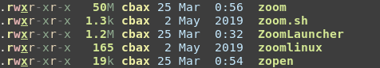

And here are some sha256 sums to figure it out:

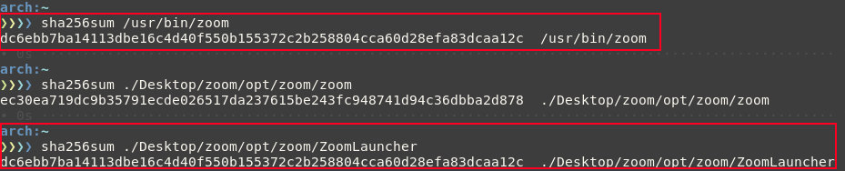

Looks like `/usr/bin/zoom` is a copy of `ZoomLauncher`. You will see later why this is important. First thing to do is open up the 1.2M `ZoomLauncher` executable in radare2 and see what we can find.

## ZoomLauncher Analysis

Running `ZoomLauncher` from a terminal gives us some interesting output:

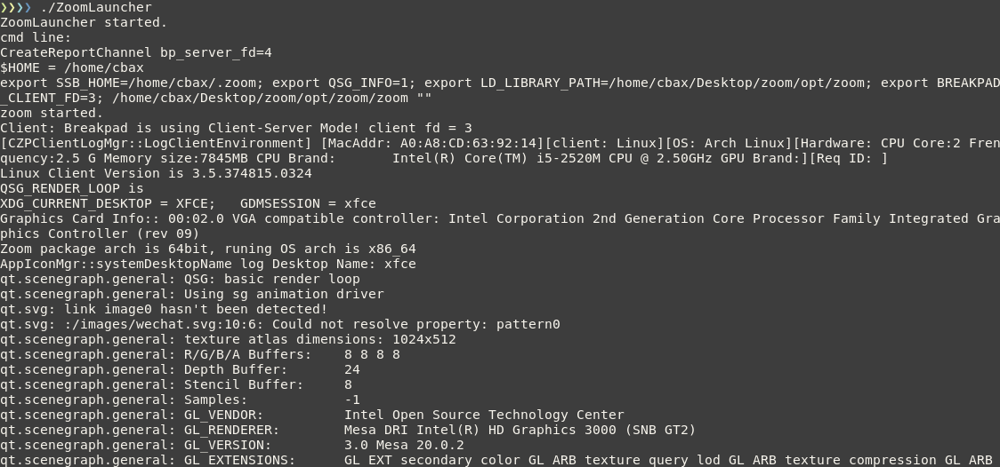

The launcher starts be reading and setting some environment variables. It does this by executing bash one-liners. These scripts are stored in the `ZoomLauncher` binary:

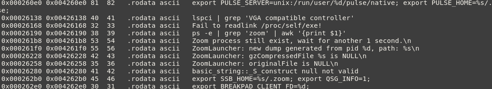

By analyzing the binary in radare2 we can find many interesting strings. Here we can see several calls to `export` as well as some other interesting one-liners stored as strings in the binary. These are later executed by the launcher at startup. Here are a few more interesting strings:

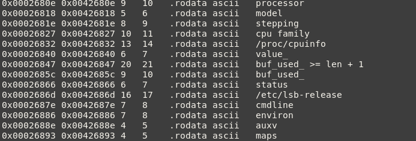

These seem to be used as arguments for some function. We begin to see the large amount of system profiling the Zoom client does. It is important to note the launcher's use of [breakpad](https://chromium.googlesource.com/breakpad/breakpad) (the variable `BREAKPAD_CLIENT_FD` makes this obvious). It is possible all of this system profiling is just a component of breakpad that may or may not be used.

The launcher is not stripped, allowing us to get a better understanding of how it uses these strings:


### ZoomLauncher DoS

The first thing to look at is what functions utilize these strings. There is a particularly interesting one-liner in the strings that, depending on how the data returned is used, could make the zoom client believe an impostor process belongs to it:

```bash
ps -e | grep 'zoom' | awk '{print $1}'
```

This returns the PID of every process with the name `zoom`. Let's see how it is used in the binary. Looking at references to the string at `0x00426190` we find the following:


`sym.getZoomPid` seems interesting:

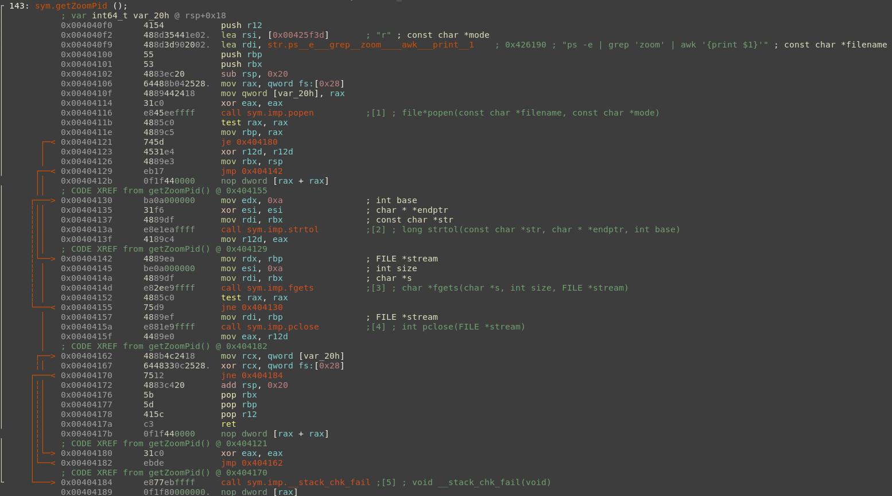

The one-liner is executed via `popen()`. The client then parses the output of the executed one-liner and stores it in a `long int` using `strtol()`.  By following the cross references we can see where this `getZoomPid()` function is called:

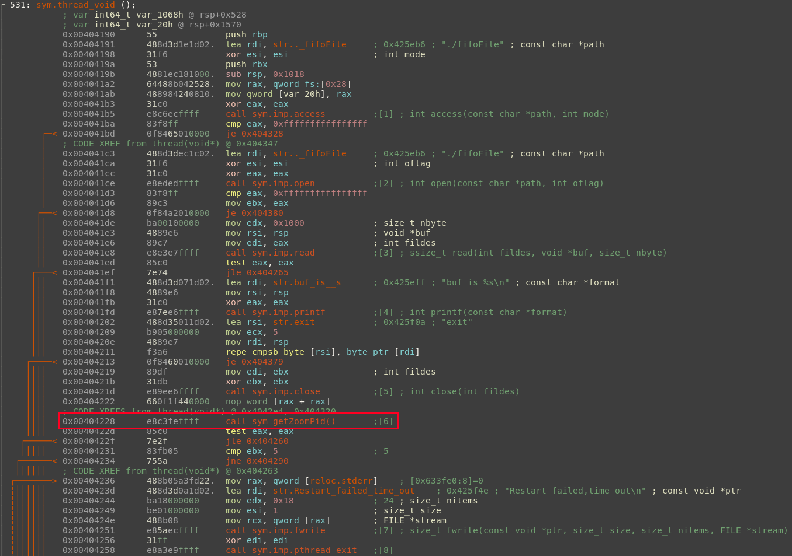

The PID returned by the `getZoomPid()` function allows the launcher to determine if an instance of the Zoom client is already running. We can also see that the launcher attempts to do something with a file called `fifoFile` during this code flow. I could not obtain a copy of this file while testing but I suspect it is similar to `.pid` files used by daemons to determine if an application is already running.

Because of the lack of checking in place, any process with the name `zoom` can count as a Zoom client process. We can trivially block this functionality into a fail state by running a dummy process with the name `zoom` before the launcher is called. It would be much better to make a call to `getpid()` or `pidof()` as well as some simple analysis of the calling binaries' path to determine if the process actually is a Zoom client. We can use the following code to attempt to block the launch of the Zoom client:

```c
/*************************************************
 * A dummy C executable, sits and consumes a PID.*
 *************************************************
 * Author: LogoiLab                              *
 * Date:   2020-04-03                            *
 * URL:    https://computeco.de/2020-04-03.html  *
 *************************************************/
#include <stdlib.h>
#include <unistd.h>

int main(int argc, char *argv[]) {
  long waittime = 10;
  if (argc > 1) {
    char * end;
		waittime = strtol(argv[1], &end, 10);
	}
  sleep(waittime);
  return 0;
}
```

This program will simply sit and wait for the specified amount of time. This is what we get if we run the program after naming it `zoom` like so:

```bash
./zoom 200 # run dummy.c code with a sleep of 200 seconds
```

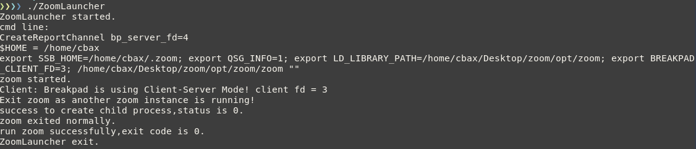

Success! we have blocked the launch of the Zoom client. A trivial DoS.

### ZoomLauncher Command Injection

In our previous analysis, we found an interesting string further into the main thread's code:

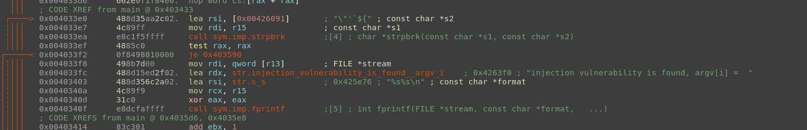

And indeed we can trigger this flow by attempting command injection on `ZoomLauncher`:

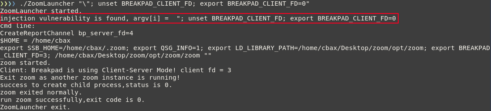

But we can also break it with `"\\"`:

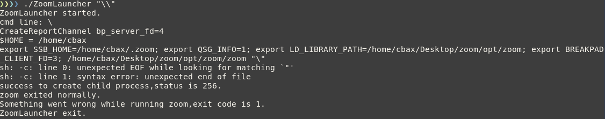

This is due to the launcher not including backslashes in its injection detection routine. Unfortunately after hours of messing with this particular vulnerability I never achieved code execution. I did however find a path rewrite issue:


This is interesting, but not worth hunting down.