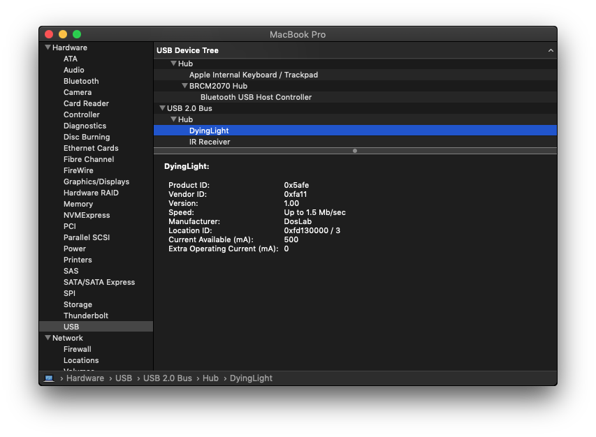
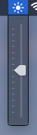
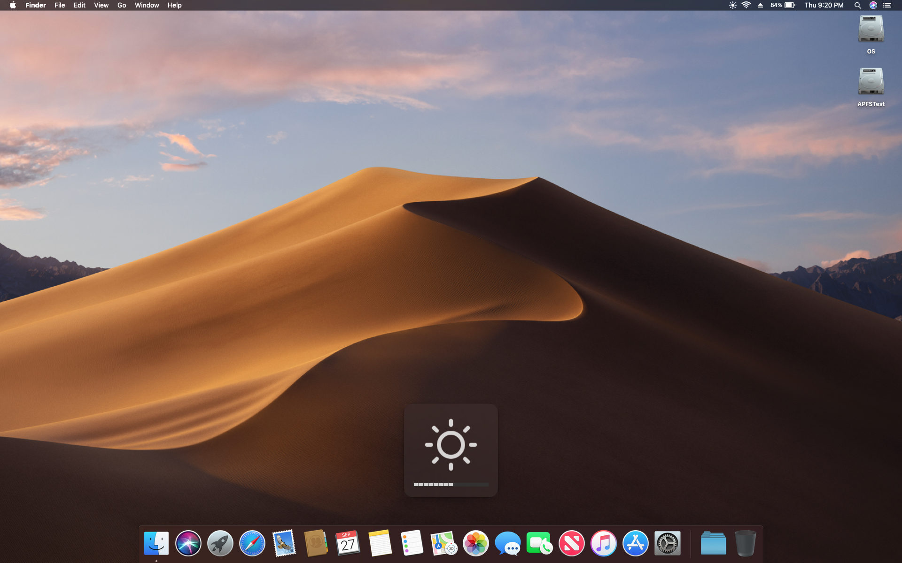

# DyingLight: Software and Hardware to Bring Back Brightness Functionality of MacBooks.

## Introdu​​​​​​​​​​​​​​​​​​​​​​​​​​​​​​​​​​​​​​​​​​​​​ction

This project is the byproduct of a simple pr​​​​​​​​​​​​​​​​​​​​​​​​​​​​​​​​​​​​​​​​​​​​​oblem described over a late night burrito at Chipotle. DosDude1 _(Of High Sierra Patcher fame)_ had created a mod for MacBooks who's dedicated graphics chip had died. This mod allowed an owner to permanently bypass the dedicated graphics to use the integrated graphics instead. This was d​​​​​​​​​​​​​​​​​​​​​​​​​​​​​​​​​​​​​​​​​​​​​one by bypassing the graphics muxing chip on the mainboard of the machine. You can read more about it [here](https://cpcde.page.link/isR1) on his MacRumors post.

There was one slight problem. This mod required the owner to pass 3.3v to the backlight controller. This device, becau​​​​​​​​​​​​​​​​​​​​​​​​​​​​​​​​​​​​​​​​​​​​​se it takes a PWM signal would interpret the 3.3v as max brightness. This usually isn't an issue, until someone would like to use their MacBook in the dark.

Quite simply a solution to output the proper PWM signal to the backlight controller was nee​​​​​​​​​​​​​​​​​​​​​​​​​​​​​​​​​​​​​​​​​​​​​ded. This was easy, until you factor in the fact that the user is going to want to control the backlight using the native controls on their system. DosDude and I began our deep dive into hardware modding taking on the concatenation of our usern​​​​​​​​​​​​​​​​​​​​​​​​​​​​​​​​​​​​​​​​​​​​​ames _Dos_**Lab** as our psuedonym for this project. Below you will learn all about project **DyingLight** including how to use it to return your MacBook to almost-native glory.

if you would like you can [DONATE](https://cpcde.page.link/FJXh) to the project. This will help bring production cost down.

## Table of contents
- [Hardware](#hardware)
  - [Overview](#hw_overview)
  - [Installation](#hw_install)
  - [Buy](#buy)
- [Software](#software)
  - [Introduction](#sw_intro)
  - [Requirements](#sw_reqs)
      - [OS X](#sw_reqs_osx)
      - [Windows](#sw_reqs_win)
      - [Linux](#sw_reqs_nix)
  - [Downloads](#downloads)

## Hardware<a name="hardware"></a>
<div style="display: block; margin-left: auto; margin-right: auto; text-align: center;">
<a href="assets/img/pcb-brd.svg">
<br>
<strong>The Mk.I DyingLight PCB</strong></a>
<br>
<p>Actual size: 24mmx25mm</p>
</div>

### Overview <a name="hw_overview"></a>

DyingLight is a simple USB v1.1 device that is solde​​​​​​​​​​​​​​​​​​​​​​​​​​​​​​​​​​​​​​​​​​​​​red onto an unused USB header on MacBook mainboards. It takes power from any 3.3v rail on the system and sits above the hard drive in the hard drive tray. The PWM signal line for the backlight controller requires that a 0Ohm resistor be removed at a specific point on the board. The signal line will be sold​​​​​​​​​​​​​​​​​​​​​​​​​​​​​​​​​​​​​​​​​​​​​ered to the pad the 0Ohm resistor used to use. Once everything is wired up you're all set for first boot to install the drivers. The DyingLight chip defaults to full brightness on first boot enabling you to access the system to install the drivers. If all soldering jobs are done perfectly the backlight should come on immediately at boot.

### Installation <a name="hw_install"></a>

### <u>Warning: When following the install steps below please be ​​​​​​​​​​​​​​​​​​​​​​​​​​​​​​​​​​​​​​​​​​​​​sure to use insulated wire and pay attention to all steps of the process. Skipping a step or skimping on insulation like conformal coating or electrical tape wrappings may result in shorts on the board causing permanent damage to your system.</u>

You can purchase your own module from EBay <strong>[HERE](https://cpcde.page.link/V6dk)<strong><a name="buy"></a>

To install the device, it is recommended to connect each pad on the DyingLight board to its respective point on the MacBook logic board using small jumper wires. Route these wires to be long enough to reach from the hard disk drive area (17" MacBooks) or beside the wireless module (15" MacBooks) to the respective points on the logic board. First, though, a few components need to be removed from the board, in addition to those removed to perform the inital gMux IC bypass. First, **R9704** needs to be removed. This resistor is what connects the **BKLT_PWM** rail to the gMux IC, and removing it will prevent the gMux from pulling the line down. Second, the 2 pullup resistors on the unused USB data lines need to be removed. These are **R0915** and **R0916**. Once these are removed, we are now ready to begin soldering the wires.

<div style="display: block; margin-left: auto; margin-right: auto; text-align: center;">
<a href="assets/img/install_2.jpg">
<br>
<strong>Approximate wiring lengths needed. (For 17")</strong></a>
<div style="display: block; margin-left: auto; margin-right: auto; text-align: center;">
<a href="assets/img/install_4.jpg">
<br>
<strong>Approximate wiring lengths needed. (For 15")</strong></a>
<br>
<br>
</div>

The pad labeled **3.3V** on the DyingLight board needs to be connected to the **PP3V3_S3** rail on the logic board. There are many points on the board where this rail is located, but I'd recommend solding it to pin 1 of **C5926**.

The ground pad (labeled **GND**) needs to be connected to any grounding point in the system. I'd recommend soldering it to the shield on one of the USB ports of the logic board, or to one of the many grounding pins sticking up off the board.

The next line we need to solder is the **PWM** output line. This needs to connect to pin 2 of **R9704**, which is the resistor you previously removed off the **BKLT_PWM** rail.

Lastly, the USB data lines need to be soldered. The **D+** line will be soldered to pin 2 of **R0915** (previously removed), and the **D-** line needs to be soldered to pin 2 of **R0916** (previously removed).

These are high definition images it is recommended that you open them in a new tab and zoom in on them for reference during install. The liquid you see on the board around the DyingLight traces is flux used for soldering.

<div style="display: block; margin-left: auto; margin-right: auto; text-align: center;">
<a href="assets/img/install_3.jpg">
<br>
<strong>Solder-points on board.</strong></a>
<br>
<br>
</div>

Once all the wires are soldered, mount the board onto the top of your hard disk drive. Be sure to insulate the entire DyingLight board (conformal coating, wrap w/ electrical tape, etc.), and secure it to the top of the drive with adhesive or double-sided tape.

<div style="display: block; margin-left: auto; margin-right: auto; text-align: center;">
<a href="assets/img/install_1.jpg">
<br>
<strong>DyingLight chip affixed to the top of the drive.</strong></a>
<br>
<br>
</div>

Here is a video of the functioning device:

<div style="display: block; margin-left: auto; margin-right: auto; text-align: center;">
<iframe width="560" height="315" src="https://www.youtube.com/embed/Xu0iZwC79GA" frameborder="0" allow="autoplay; encrypted-media" allowfullscreen></iframe>
</div>

## Softw​​​​​​​​​​​​​​​​​​​​​​​​​​​​​​​​​​​​​​​​​​​​​are <a name="software"></a>

### Introduction <a name="sw_intro"></a>

DyingLight is compatible with any operating system that will run on your MacBook Pro, including Windows, various Linux distros, and of course, Mac OS X. Since most users will be using the device under Mac OS X, the OS X software includes many enhancements, integrating it seamslessly with the OS. The Windows and Linux versions are command-line apps that are easily used with hotkey bindings and startup entries.

### Requirements <a name="sw_reqs"></a>

#### _OS X_ <a name="sw_reqs_osx"></a>

<div style="display: block; margin-left: auto; margin-right: auto; text-align: center;">
<a href="assets/img/osx_drv_0.png">
<br>
<strong>DyingLight device registered with OS X.</strong></a>
</div>

<br>

<div style="display: block; margin-left: auto; margin-right: auto; text-align: center;">
<a href="assets/img/osx_drv_1.png">
<br>
<strong>Integrated manual slider.</strong></a>
</div>

<br>

<div style="display: block; margin-left: auto; margin-right: auto; text-align: center;">
<a href="assets/img/osx_drv_2.png">
<br>
<strong>Native-feel keyboard button support and feedback.</strong></a>
</div>

<br>

To get the driver running, all you'll need to do is run the installer package and reboot your machine.

<hr>

#### _Windows 7/8/10_ <a name="sw_reqs_win"></a>

The driver is a command lin​​​​​​​​​​​​​​​​​​​​​​​​​​​​​​​​​​​​​​​​​​​​​e interface with flags that allow easy keybinding and startup entries.

The driver comes bundled with the libusb DLL files it requires, do not separate them.

```

DyingLight 0.2.1
LogoiLab:DosDude1
A utility to set the backli​​​​​​​​​​​​​​​​​​​​​​​​​​​​​​​​​​​​​​​​​​​​​ght brightness of a system with the DyingLight mod installed.

USAGE:
    dyinglight [FLAGS] [OPTIONS]

FLAGS:
    -a, --align      Fixes brightness after a reb​​​​​​​​​​​​​​​​​​​​​​​​​​​​​​​​​​​​​​​​​​​​​oot. Should be called by a startup process
    -d, --down       Turns the brightness down one tick
    -h, --help       Prints help inform​​​​​​​​​​​​​​​​​​​​​​​​​​​​​​​​​​​​​​​​​​​​​ation
    -u, --up         Turns the brightness up one tick
    -V, --version    Prints version information

OPTIONS:
    -s, --set <set>    <1-16>: Sets the brightness to a specific value
```
<hr>
#### _Linux_ <a name="sw_reqs_nix"></a>

The driver is a command li​​​​​​​​​​​​​​​​​​​​​​​​​​​​​​​​​​​​​​​​​​​​​ne interface with flags that allow easy keybinding and startup entries.

There are a few things you must do to get the driver working for linux.

Install the `libusb` package.

_ArchLinux:_ `libusb`


_Ubuntu/Debian:_ `libusb-1.0-0-dev`

Then type the following comma​​​​​​​​​​​​​​​​​​​​​​​​​​​​​​​​​​​​​​​​​​​​​nd into your terminal:
```
sudo vim /etc/udev/rules.d/99-dying_light.rules
```

Then paste this into vim:
```
ACTION!="add|change", GOTO="dying_light_rules_end"
SUBSYSTEM!="usb|tty|hidraw", GOTO="dying_light_rules_end"

ATTRS{idVendor}=="fa11", ATTRS{idProduct}=="5afe", MODE="664", GROUP="plugdev"

LABEL="dying_light_rules_end"
```

Save your changes by hitting `esc` and typing `:wq`.

Type the following command:
```
sudo usermod -aG plugdev $USER
```

You may have to replace `$USER` with your username.

Log out and log b​​​​​​​​​​​​​​​​​​​​​​​​​​​​​​​​​​​​​​​​​​​​​ack in and you should be ready to go.

### <strong>_Downlo​​​​​​​​​​​​​​​​​​​​​​​​​​​​​​​​​​​​​​​​​​​​​ads_</strong> <a name="downloads"></a>

[Mac OS X >= 10.6 Sn​​​​​​​​​​​​​​​​​​​​​​​​​​​​​​​​​​​​​​​​​​​​​ow Leopard 64-bit](https://cpcde.page.link/corR)

[Win​​​​​​​​​​​​​​​​​​​​​​​​​​​​​​​​​​​​​​​​​​​​​dows 7/8/10 64-bit](https://cpcde.page.link/CnyS)

[Li​​​​​​​​​​​​​​​​​​​​​​​​​​​​​​​​​​​​​​​​​​​​​nux 64-bit](https://cpcde.page.link/sCZS)
