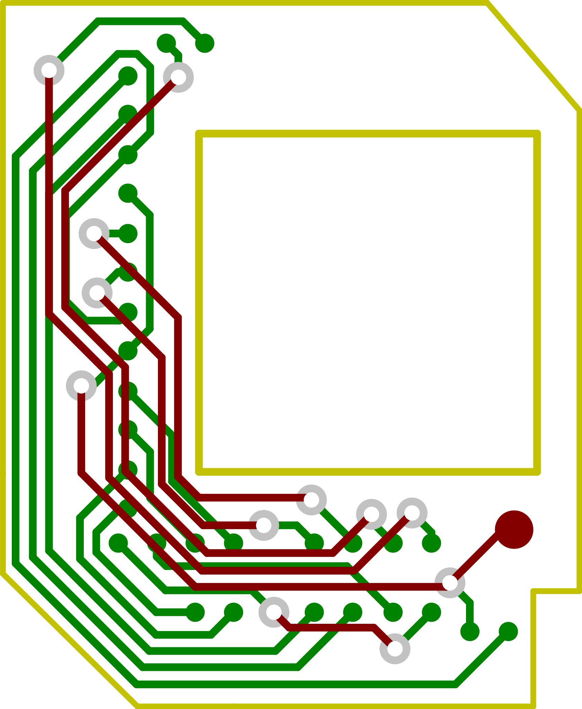

# MuxHat: Drop-in PCB to bypa​​​​​​​​​​​​​​​​​​​​​​​​​​​​​​​​​​​​​​​​​​​​​​ss the gMux IC on a 2011 15" or 17" MacBook Pro logic board.

This project was conceived to drastically reduce the amount of time and skill needed to perform a permanent hardware dedicated GPU bypass on a 20​​​​​​​​​​​​​​​​​​​​​​​​​​​​​​​​​​​​​​​​​​​​​​11 15" or 17" MacBook Pro, that has had its dedicated GPU fail. This board takes a process that normally takes 2-3 hours to perform, and requires precision soldering equipment with a microscope, down to about 15-20 minutes, with a relatively easy process. This guide will explain all the steps needed to install the MuxHat board, and get your system to work 100% reliably run​​​​​​​​​​​​​​​​​​​​​​​​​​​​​​​​​​​​​​​​​​​​​​ning off the integrated graphics only. *(For the old gMux IC bypass instructions visit the [forum post](https://cpcde.page.link/isR1))*

If you would like you can [DONATE](https://cpcde.page.link/FJXh) to the project. This will help bring production cost down.

You can buy your own MuxHat here: [**EBay Link**](https://cpcde.page.link/oPPX) *We are currently sold out of the initial batch. We will be waiting on reviews of the functionality of the product from the buyers before offering more for sale.*

We have done tireless testing of MuxHat with multiple different devices and have identified only a single issue. For most devices this issue will not occur but it still may so we're posting it here. For some reason there is a particular display module that doesn't like the way the clock lines are routed on the MuxHat. These LCDs will look absolutely horrible when using MuxHat. It is recommended to swap the LCD for one that works with MuxHat, if you have one on hand. We can offer a refund for the value of the board if you don't. Unfortunately there is no way to determine if the LCD won't like MuxHat without trying it first. We know what an incompatible LCD looks like when it displays using MuxHat and will only be able to offer the refund if you can provide a picture.

## Table of contents
- [Preparation](#prep)
- [Installation](#install)
- [Post-Installation](#post_install)
  - [Fifteen Inch MacBooks](#15in)
  - [Seventeen Inch MacBooks](#17in)
  - [All MacBooks](#both)
    - [DyingLight](#dying_light)

## Preparing logic board for i​​​​​​​​​​​​​​​​​​​​​​​​​​​​​​​​​​​​​​​​​​​​​​nstallation

Before installation, a few things need to be modified on your logic board. First, you must remove the adhesive edges from the gMux IC. To do this, heat the bottom of the board, underneath the area where the gMux IC is located. Once the board gets hot, use a pair of fine tweezers to pul​​​​​​​​​​​​​​​​​​​​​​​​​​​​​​​​​​​​​​​​​​​​​​l up the adhesive from each corner of the chip. If the board is hot enough, they should come off very easily with minimal effort.

Next, two resistors need to be removed. First, **R8911**, and then **R9704**. To remove these, either use your hot air station and tweezers to heat and remove the resistor from the board, or, put a blob of solder onto your soldering iron, and run it overtop the re​​​​​​​​​​​​​​​​​​​​​​​​​​​​​​​​​​​​​​​​​​​​​​sistor. It should come off with no force at all, and get consumed into your solder blob.

## Installing ​​​​​​​​​​​​​​​​​​​​​​​​​​​​​​​​​​​​​​​​​​​​​​the MuxHat

<a href="assets/img/gpumod-brd.svg">
 
<strong>The MuxHat PCB</strong></a>
 

Actual size: 15mmx18mm

Place the MuxHat board on top of the gMux IC, aligning the black triangle with the top left corner of the IC.​​​​​​​​​​​​​​​​​​​​​​​​​​​​​​​​​​​​​​​​​​​​​​ Make sure the IC is against the top right corner of the cut out and flush on all sides (it should sit perfectly level with the gMux IC). See the picture below.

<a href="assets/img/muxhat_install_1.jpg">
 
<strong>The MuxHat over the gMux IC</strong></a>

Once the MuxHat board has been ​​​​​​​​​​​​​​​​​​​​​​​​​​​​​​​​​​​​​​​​​​​​​​properly aligned, it is now time to heat the MuxHat, soldering it onto the board similar to soldering a BGA device. It is recommended to use a preheater during this process, but is not necessary. It will, however, make the process a bit easier. I recommend set​​​​​​​​​​​​​​​​​​​​​​​​​​​​​​​​​​​​​​​​​​​​​​ting your preheater to around 170 degrees Celsius. Once the board is up to temperature (if using a preheater), set your hot air soldering station to around 300 degrees Celsius. I recommend using a nozzle that is the same size, or larger than the MuxHat board. On most hot air stations, simply using no nozzle will be sufficien​​​​​​​​​​​​​​​​​​​​​​​​​​​​​​​​​​​​​​​​​​​​​​t, as the air outlet is usually the correct size. Heat the MuxHat using the hot air station for approximately 2 minutes (5 minutes without preheater, ensuring an even ​​​​​​​​​​​​​​​​​​​​​​​​​​​​​​​​​​​​​​​​​​​​​​heating of the board. Minimal scorching of the solder mask may occur, but will not affect functionality of the MuxHat.

**DO NOT PUT PRESSURE ON THE BOARD WHILE HEATING. DON'T TOUCH IT.** The board will melt into place without any force. If you do put force on the board, you will squeeze the solder out and will have to reball the MuxHat.

After you have finished heating,​​​​​​​​​​​​​​​​​​​​​​​​​​​​​​​​​​​​​​​​​​​​​​ let the board cool down for about a minute, and then try to move it around or lift it lightly with a pair of tweezers. If the board does not move or lift, that means it has been soldered successfully. If it does move, repeat the heating process, but heat a bit longer.

## Post-instal​​​​​​​​​​​​​​​​​​​​​​​​​​​​​​​​​​​​​​​​​​​​​​lation Wiring

While the MuxHat board does connect all the points on the board​​​​​​​​​​​​​​​​​​​​​​​​​​​​​​​​​​​​​​​​​​​​​​ needed to perform the gMux IC bypass, there are still a few enable lines that must be wired up manually.

To wire these lines, I recom​​​​​​​​​​​​​​​​​​​​​​​​​​​​​​​​​​​​​​​​​​​​​​mend using 0.1MM enamel-coated copper wire. The necessary connections are different for the 15" and 17" boards, and are listed below.

### 15" (820-2915)

- **LVDS_DDC_SEL_IG** to **PP3V3_S0**: Connect pin 1 of **R9682** to pin 1 of **C9711**

- **LVDS_IG_PANEL_PWR** to **LCD_PWR_EN**: Connect pin 1 of **R2015** to pin 1 of **R9678**

- **LVDS_IG_BKL_ON** to **LCD_BKLT_EN**: Connect pin 1 of **R2055** to pin 1 of **R0901**

### 17" (820-2914)

- **LVDS_DDC_SEL_IG** to **PP3V3_S0**: Connect pin 1 of **R9682** to pin 1 of **R9670**

- **LVDS_IG_PANEL_PWR** to **LCD_PWR_EN**: Connect pin 1 of **R2015** to pin 1 of **R9678**

- **LVDS_IG_BKL_ON** to **LCD_BKLT_EN**: Connect pin 1 of **R2055** to pin 1 of **R9840**

### For Both

If you will be performing this m​​​​​​​​​​​​​​​​​​​​​​​​​​​​​​​​​​​​​​​​​​​​​​odification, AND installing a DyingLight module, follow the procedure for installing DyingLight, found [here](https://cpcde.page.link/DuM5). If not, the following connectio​​​​​​​​​​​​​​​​​​​​​​​​​​​​​​​​​​​​​​​​​​​​​​n must be made:

- **BKL_PWM** to **PP3V3_S0**: Connect the pin 2 pad of removed **R9704** to pin 1 of **R9202**

**That's it! You've comp​​​​​​​​​​​​​​​​​​​​​​​​​​​​​​​​​​​​​​​​​​​​​​leted the install of a MuxHat.**
